<pre align="center">
<strong>Shreyas / CuriousCorrelation</strong> / <a href="mailto:CuriousCorrelation@protonmail.com">Email</a> / <a href="https://github.com/CuriousCorrelation">GitHub</a> / <a href="https://linkedin.com/in/shreyas-joshi-swe">LinkedIn</a>
</pre>

</img>

👋 Hi, I'm @CuriousCorrelation because some correlations are quite curious 🤔

I tell computers to do stuff. Sometimes I let them figure it out. I'm interested in everything software and computing, looking to collaborate on and explore Rust, distributed compute, and web apps! Beside software engineering, I'm also interested in systems programming, performance optimization, and building tools that developers actually want to use. And when I have time, I hack around with my custom kernel and explore the fascinating correlations in distributed systems. 

    

#### Tools of the Trade

Operating Systems: Custom kernel, [Gentoo Linux](https://www.gentoo.org/), [NixOS](https://nixos.org/)
Package Management: [Nix Package Manager](https://nixos.org/download.html), [declarative system configuration](https://github.com/CuriousCorrelation/nix-darwin)
Desktop Environment: [SwayWM](https://swaywm.org/) (Wayland compositor), [Alacritty](https://github.com/alacritty/alacritty) / [Wezterm](https://github.com/wezterm/wezterm) terminal
Development: [Doom Emacs](https://github.com/doomemacs/doomemacs), [LSP servers](https://microsoft.github.io/language-server-protocol/), [tree-sitter](https://tree-sitter.github.io/tree-sitter/) parsing
CLI Tools: [fzf](https://github.com/junegunn/fzf) (fuzzy finder), [ripgrep](https://github.com/BurntSushi/ripgrep) (fast search), [conventional commits](https://www.conventionalcommits.org/)
Languages: [Rust](https://www.rust-lang.org/) 🦀, [TypeScript](https://www.typescriptlang.org/), [JavaScript](https://developer.mozilla.org/en-US/docs/Web/JavaScript), [Python](https://www.python.org/), [C/C++](https://isocpp.org/), [Nix](https://nixos.org/manual/nix/stable/)
Technologies: [Tauri](https://tauri.app/), [WebAssembly](https://webassembly.org/), [libcurl](https://curl.se/libcurl/), distributed systems, microVMs

#### Interesting Correlations

Some curious correlations I've discovered while building software:

- The relationship between developer ergonomics and system performance
- How declarative configuration reduces cognitive load in complex systems
- Why blazingly fast tools often have the simplest interfaces
- The correlation between good documentation and project adoption rates
- How Rust's ownership model mirrors distributed system design patterns

---

*"Sometimes the most curious correlations are the ones hiding in plain sight."* 🤔
